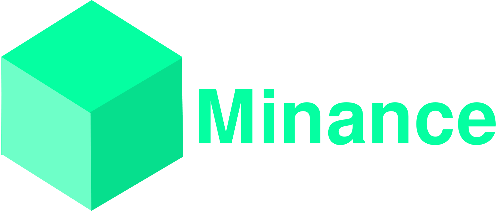
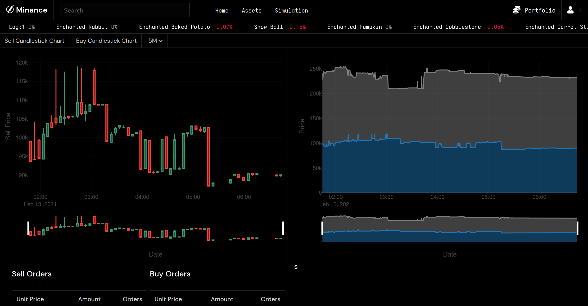

https://minance.net/

Simple data visualization, analysis and simulation for the Hypixel Skyblock bazaar.

## About the Project

### Built With

- [Flask](https://flask.palletsprojects.com/en/1.1.x/)
- [PostgreSQL](https://www.postgresql.org/)
- [SASS](https://sass-lang.com/)

## Roadmap

See the [open issues](https://github.com/minancenet/web/issues) for a list of proposed features (and known issues).

## Contributing

Minance is open to contributions, but I recommend creating an issue or replying in a comment to let me know what you are working on first that way we don't overwrite each other.

## Social

- Discord: https://discord.gg/ERRDyRZ7dR
- Twitter: https://twitter.com/minance

## Acknowledgements

- Design heavily inspired by [CryptoWatch](https://cryptowat.ch)
- Charts created with [Plotly.js](https://plotly.com/)
- Icons from [Font Awesome](https://fontawesome.com/)
- Data from [Hypixel API](https://api.hypixel.net/)
