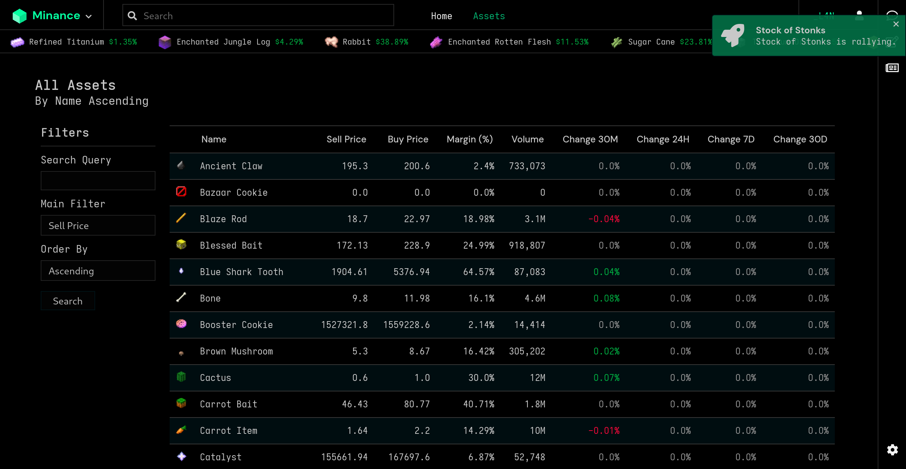

  

  <i>Simple data visualization, analysis and simulation for the Hypixel Skyblock bazaar.</i>

  
  
  
  

<h3 align="center">  
  <a href="https://github.com/minancenet/web/blob/master/CONTRIBUTING.md">Contribute</a>
   · 
  <a href="https://discord.gg/ERRDyRZ7dR">Community</a>
   · 
  <a href="#">Documentation</a>
</h3>

<b>https://minance.net/</b>

## About the Project

### Built With

- [Flask](https://flask.palletsprojects.com/en/1.1.x/)
- [PostgreSQL](https://www.postgresql.org/)
- [SASS](https://sass-lang.com/)

## Roadmap

See the [open issues](https://github.com/minancenet/web/issues) for a list of proposed features (and known issues).

## Contributing

Minance is open to contributions, but I recommend creating an issue or replying in a comment to let me know what you are working on first that way we don't overwrite each other.

Please read [CONTRIBUTING.md](https://github.com/minancenet/web/blob/master/CONTRIBUTING.md) for details on this project.

## Code of Conduct

Please read [CODE_OF_CONDUCT.md](https://github.com/minancenet/web/blob/master/CODE_OF_CONDUCT.md) for details on our code of conduct.

## Social

- Discord: https://discord.gg/ERRDyRZ7dR
- Twitter: https://twitter.com/minancenet

## Acknowledgements

- Design heavily inspired by [CryptoWatch](https://cryptowat.ch)
- Data from [Hypixel API](https://api.hypixel.net/)
- Charts created with [Plotly.js](https://plotly.com/)
- Icons from [Font Awesome](https://fontawesome.com/)
